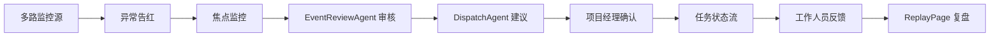

# Stage 5 Demo Scenario

## 演示故事线

Stage 5 固定演示按 09:55 到 10:40 展开，重点展示多监控源异常发现、双 Agent 审核建议、项目经理确认、任务状态和复盘。

| 时间 | 场景 | 页面 | 目标 |
|---|---|---|---|
| 09:55 | 开馆前检查 | Dashboard | 确认项目、实时监控和复盘入口 |
| 10:00 | 观众入场 | LivePage | 展示多监控源和多区域运行视图 |
| 10:03 | 入口 A 排队增长 | LivePage | 总监控卡片告红 |
| 10:05 | 识别 `entrance_congestion` | LivePage | 进入入口 A 焦点监控 |
| 10:06 | EventReviewAgent 审核 | LivePage | 说明发生了什么、证据、风险和处理必要性 |
| 10:06 | DispatchAgent 建议 | LivePage | 推荐动作、执行人、备选人和派发原因 |
| 10:07 | 项目经理确认 | LivePage | 建议进入任务状态流 |
| 10:07 | 工作人员到达 | Mobile / LivePage | 展示现场反馈 |
| 10:10 | 拥堵缓解 | LivePage | 展示任务进度 |
| 10:20 | 展台 512 热度升高 | LivePage | 展示第二路监控源异常 |
| 10:22 | 通知展台接待 | LivePage | 展示接待任务状态 |
| 10:30 | 设备异常检查 | LivePage | 展示 critical 告警和技术支持建议 |
| 10:40 | 审计复盘 | ReplayPage | 展示双 Agent 处理过程和任务记录 |

## 页面路线

| 页面 | 路由 | 看什么 |
|---|---|---|
| Dashboard | `/#/projects` | 项目入口、运行状态、LivePage / ReplayPage 入口 |
| LivePage | `/#/project/project-spring-2026/live` | 总监控卡片、焦点监控、EventReviewAgent、DispatchAgent、项目经理确认、任务状态、工作人员反馈 |
| Mobile H5 | `/#/mobile` | 工作人员反馈 demo 状态 |
| ReplayPage | `/#/project/project-spring-2026/replay` | 监控源、告警、双 Agent、确认、任务、反馈、审计记录 |

## 操作步骤

| 顺序 | 操作 | 页面上看什么 | 讲解话术 |
|---:|---|---|---|
| 1 | 打开 Dashboard | 项目总览和路由入口 | “演示从会展现场控制台开始，项目、实时监控和复盘入口都在同一套系统里。” |
| 2 | 进入 LivePage | 多区域视图、总监控卡片、camera replay、Agent 驾驶舱 | “观众入场后，多路监控源同时把现场信号放到一个运营视图里。” |
| 3 | 点击入口 A 异常监控卡片 | 入口 A、High 告警、sourceName、zoneName、timestamp | “入口 A 先由监控源告红，项目经理从总监控面板定位到异常区域。” |
| 4 | 查看焦点监控 | `entrance_congestion`、证据摘要、处理状态 | “系统识别入口拥堵，但仍只把它作为运营输入，不自动执行任务。” |
| 5 | 指向 EventReviewAgent | what happened、evidence、risk level、handling decision、confidence | “事件审核 Agent 负责说明发生了什么、证据是什么、风险等级以及是否需要处理。” |
| 6 | 指向 DispatchAgent | recommendedAction、primaryAssignee、backupAssignees、reasons | “派发建议 Agent 推荐动作和执行人，但它只给建议，不创建任务。” |
| 7 | 展示项目经理确认 | pending_manager_confirmation、suggested、created、dispatched、in_progress | “确认权在项目经理手里，确认后才进入任务状态展示。” |
| 8 | 打开 Mobile 或 LivePage 反馈摘要 | staffName、role、status、message、supportRequested | “现场人员反馈到达后，任务从建议变成可展示的执行状态。” |
| 9 | 回到 LivePage | 任务状态流、反馈摘要、运营摘要 | “入口压力降低后，现场处理过程可以被复盘。” |
| 10 | 点击展台 512 监控源 | booth_heatup、reviewing、接待建议 | “同一套监控和建议过程可以复用到展台热度场景。” |
| 11 | 展示展台接待任务 | actionLabel、assigneeLabel、completed、反馈 | “展台接待任务展示的是不同区域共享同一套任务表达。” |
| 12 | 点击设备异常监控源 | critical alert、technical support、blocked、need_support | “设备异常优先级更高，但仍然只是 demo 建议和展示层，不接真实执行器。” |
| 13 | 打开 ReplayPage | 监控源、告警、事件审核 Agent、派发建议 Agent、项目经理确认、任务反馈、审计记录 | “复盘页说明哪个监控源发现问题、为什么需要处理、建议谁处理、是否确认、反馈如何。” |

## 失败处理

| 问题 | 处理 |
|---|---|
| OpenClaw Adapter 不通 | 说明 OpenClaw 只影响解释来源；系统可使用本地 fallback 继续展示 |
| 入口卡片未处于焦点 | 点击 High 或 Entrance A 监控卡片 |
| 双 Agent 面板未切到入口事件 | 重新点击入口 A 监控卡片，使用本地 demo 结果 |
| 派发候选人展示空间不足 | 讲主执行人和备选执行人字段，不临时改 UI |
| 手机无法访问本机地址 | 在桌面浏览器打开 `/#/mobile` |
| ReplayPage 日志较少 | 聚焦双 Agent 复盘面板和任务详情，不声称有真实后端审计扩展 |
| dev server 未启动 | 运行 `npm run dev` |

## 固定边界

| 模块 | 边界 |
|---|---|
| OpenClaw | 只输出 `why_event`、`why_action`、`why_assignee`、`why_state` |
| EventReviewAgent | 本地规则型 demo，只说明事件和风险，不审批、不执行 |
| DispatchAgent | 本地规则型 demo，只给派发建议，不创建任务 |
| 项目经理确认 | 派发建议必须经过确认后才进入任务状态展示 |
| Vision | 保持现有 replay / debug 输入，不接真实摄像头 |
| Task | 使用前端 demo 数据，不接真实后端 |
| Audit | 只增强展示，不改 audit store |
| Risk / takeover / rollback | 保持冻结，不改主逻辑 |

## 验收标准

| 标准 | 结果 |
|---|---|
| 剧本能按 09:55-10:40 顺序讲完整 | 必须满足 |
| LivePage 能展示总监控、焦点监控、双 Agent、项目经理确认、任务反馈 | 必须满足 |
| ReplayPage 能展示双 Agent 处理过程和审计上下文 | 必须满足 |
| OpenClaw 被明确说明为 explanation source only | 必须满足 |
| EventReviewAgent / DispatchAgent 被明确说明为本地 demo 模型 | 必须满足 |
| 不改业务主链、不接真实后端、不接真实摄像头 | 必须满足 |

## Agent 专业知识讲解补充

主案例仍然是“入口 A 人流拥堵异常处置”。

| 页面 | 讲解重点 |
|---|---|
| LivePage | EventReviewAgent 展示专业判断依据、缺失证据和项目经理确认清单；DispatchAgent 展示候选人评分、备选方案和禁止自动派发提示 |
| Mobile H5 | 工作人员只看到任务、地点、时限、操作按钮和反馈，不展示复杂 Agent 内部细节 |
| ReplayPage | 展示监控信号、事件审核、派发建议、项目经理确认、工作人员反馈、复盘报告的 Agent 协作记录 |

对外话术：

> 这里的 Agent 不是自动派单机器人。EventReviewAgent 负责解释异常和证据，DispatchAgent 负责给出动作和人员建议，项目经理保留确认权。确认后才进入任务状态展示，工作人员反馈后进入复盘记录。

真实摄像头当前可用于本机演示接入，但还不是生产级多路监控接入；现场路演仍以本地稳定 demo 数据为主。
